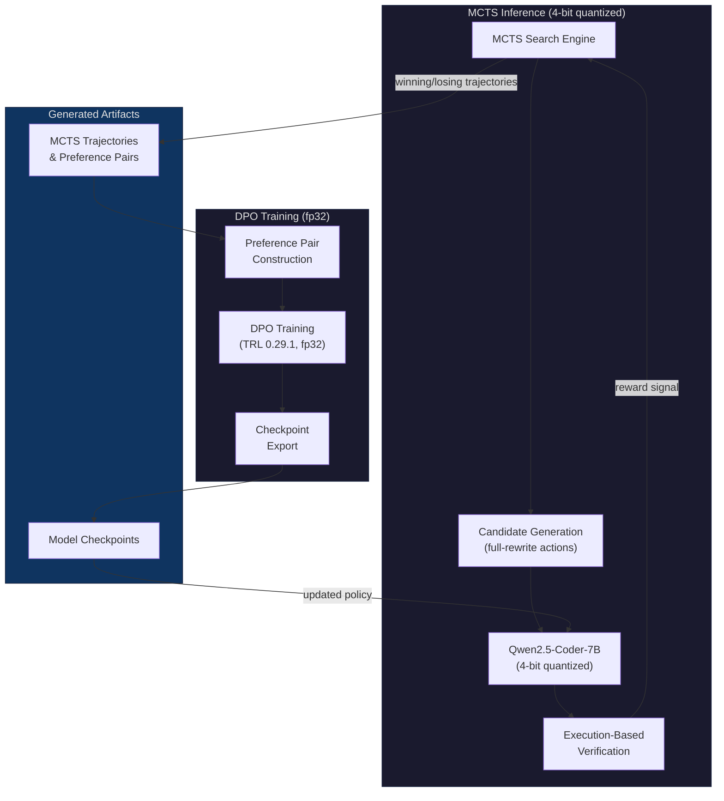

# CodeQ: Self-Improving Code Debugging via MCTS and DPO

An autonomous code debugging agent that combines Monte Carlo Tree Search (MCTS) with Direct Preference Optimization (DPO) to iteratively improve bug-fixing capabilities. Built on Qwen2.5-Coder-7B-Instruct and evaluated on DebugBench.

## Key Results

| Mode                       | Base Model | + DPO Round 2    |
| -------------------------- | ---------- | ---------------- |
| Full Rewrite (single pass) | 43.9%      | **55.6%** (n=72) |
| MCTS Rewrite (20 rollouts) | 81.3%      | **92.0%** (n=50) |

DPO Round 2 improves both MCTS and single-pass modes. The 92% MCTS result uses 20 rollouts at inference time.

## Model & Data

- **LoRA Adapter:** [tathadn/codeq-qwen2.5-coder-7b-dpo-r2](https://huggingface.co/tathadn/codeq-qwen2.5-coder-7b-dpo-r2) on HuggingFace
- **DPO Preference Dataset:** [tathadn/codeq-debugbench-dpo-pairs](https://huggingface.co/datasets/tathadn/codeq-debugbench-dpo-pairs) on HuggingFace
- **Base Model:** [Qwen/Qwen2.5-Coder-7B-Instruct](https://huggingface.co/Qwen/Qwen2.5-Coder-7B-Instruct)

```python
from peft import PeftModel
from transformers import AutoModelForCausalLM, AutoTokenizer

base = AutoModelForCausalLM.from_pretrained("Qwen/Qwen2.5-Coder-7B-Instruct", torch_dtype="auto", device_map="auto")
model = PeftModel.from_pretrained(base, "tathadn/codeq-qwen2.5-coder-7b-dpo-r2")
```

## Architecture

CodeQ runs MCTS inference and DPO training sequentially on NVIDIA H100 GPUs:



### Self-Improvement Loop

1. **MCTS Search** — Tree search over candidate rewrites, scoring each via execution against test cases
2. **Trajectory Collection** — Winning (pass) and losing (fail) rewrites are paired per problem
3. **DPO Training** — The policy is trained on preference pairs using Direct Preference Optimization
4. **Policy Update** — The improved checkpoint is loaded back into the MCTS inference engine
5. **Repeat** — Each round generates harder preference signal as the policy improves

### Design Decisions

- **Full-rewrite action space over line-level edits.** Line-level edits achieved only ~10% solve rate due to compounding error across multi-line fixes. Switching to full-rewrite generation raised the base MCTS rate to 81.3% — the single largest improvement in the project.
- **4-bit inference / fp32 training split.** Quantized inference keeps MCTS rollouts fast (~16 GB VRAM); fp32 training preserves gradient quality and prevents NaN overflow.
- **fp32 training (not bf16).** bf16 training produced NaN losses from logit overflow across multiple attempts. A module-level monkey-patch of `selective_log_softmax` to upcast to fp32, combined with full fp32 training, resolved this completely.
- **Degenerate pair filtering.** 38% of MCTS-generated preference pairs had identical chosen/rejected completions. Filtering these before DPO training was critical for stable learning.

## Ablation Studies

> **Note:** The ablation studies below were conducted during initial development using the original DebugBench test split and bf16 training. Headline results (92% MCTS, 55.6% single-pass) reflect the final rebuilt model with fp32 training, synthesized oracle-based tests, and degenerate pair filtering. The ablations remain valid for understanding how MCTS and DPO interact across bug categories, difficulty levels, and rollout budgets.

### By Bug Category

| Category  | Rewrite (base) | MCTS (base) | MCTS (+ DPO) |
| --------- | -------------- | ----------- | ------------ |
| Syntax    | 61.9%          | 95.0%       | 95.0%        |
| Logic     | 45.8%          | 90.0%       | 85.0%        |
| Reference | 55.9%          | 80.0%       | 80.0%        |
| Multiple  | 31.8%          | 90.0%       | 85.0%        |

MCTS saturates on syntax errors (95%) where the search space is narrow. The largest rewrite→MCTS gains appear on multiple-fault bugs (31.8% → 90%), where iterative search over full rewrites avoids the combinatorial explosion of line-level patches.

### By Difficulty

| Difficulty | Rewrite (base→DPO) | MCTS (base→DPO) |
| ---------- | ------------------ | --------------- |
| Easy       | 56.8% → 56.8%      | 90% → 90%       |
| Medium     | 40.7% → 44.4%      | 90% → 90%       |
| Hard       | 34.4% → 34.4%      | 80% → **85%**   |

DPO improves performance where it matters most: hard problems under MCTS search (80% → 85%). Easy and medium problems are already saturated by MCTS alone.

### By Rollout Budget

| Rollouts | MCTS (base) | MCTS (+ DPO) |
| -------- | ----------- | ------------ |
| 1        | 80%         | 78%          |
| 2        | 80%         | 80%          |
| 5        | 80%         | 82%          |
| 10       | 84%         | 84%          |
| 20       | 84%         | 86%          |

Performance plateaus at ~10 rollouts. The DPO policy shows a slight advantage at higher rollout budgets (86% at 20 vs 84%), suggesting DPO produces candidates that are more distinguishable under extended search.

## Key Engineering Findings

| Finding                                  | Impact                                                       |
| ---------------------------------------- | ------------------------------------------------------------ |
| Full-rewrite action space                | 10% → 81.3% solve rate                                       |
| 81% data duplication in DebugBench       | Discovered and deduplicated via sha256 content hashing       |
| fp32 training (not bf16)                 | bf16 caused NaN across 5+ attempts; fp32 fully stable        |
| Module-level selective_log_softmax patch | Upcasts logits to fp32 before log-softmax computation        |
| TRL pinned to 0.29.1                     | Later versions introduced breaking changes to DPO trainer    |
| transformers pinned to <5                | transformers 5.x breaks TRL 0.29.1 API                       |
| Degenerate pair filtering                | 38% of pairs had chosen==rejected — must filter before training |
| precompute_ref_log_probs=False           | Avoids truncation mismatch between ref and live forward passes |
| truncation_mode=keep_end                 | Prevents cutting off completion tails                        |
| DPO transfers to single-pass in Round 2  | 43.9% → 55.6% single-pass (unlike Round 1 where no transfer occurred) |

## Project Structure

```
codeq/
├── src/                    # Core source modules
│   ├── mcts.py             # MCTS search engine (UCB1, expand, backprop)
│   ├── agent.py            # Full-rewrite action generation and parsing
│   ├── critic.py           # AI self-critique (temp=0.2 scoring)
│   ├── sandbox.py          # Docker sandbox (no net, 512MB, 30s timeout)
│   ├── preferences.py      # Preference pair construction from trajectories
│   ├── train_dpo.py        # DPO training (TRL 0.29.1, fp32 logit upcast)
│   ├── evaluate.py         # DebugBench evaluation harness
│   ├── merge_lora.py       # LoRA adapter merge into base model
│   └── utils.py            # Shared helpers, logging, config loading
├── configs/                # Hyperparameter configs (YAML)
│   ├── mcts_config.yaml    # MCTS search parameters
│   ├── train_config.yaml   # DPO Round 2 config
│   ├── train_config_round1.yaml
│   ├── train_config_round2_fp32.yaml
│   └── eval_config.yaml
├── scripts/                # Shell scripts and utilities
│   ├── collect.sh          # MCTS trajectory collection launcher
│   ├── evaluate.sh         # Evaluation suite runner
│   ├── prepare_data.py     # DebugBench download, dedup, split (seed=42)
│   ├── filter_degenerate_pairs.py  # Drop chosen==rejected pairs
│   └── hf_upload_phase10.py        # HuggingFace upload
├── tests/                  # Unit tests (88 passing)
├── reports/                # Ablation results and analysis
└── requirements.txt        # Pinned dependencies
```

## Setup

### Requirements

- NVIDIA H100 GPU (or equivalent with ≥80 GB VRAM for fp32 training)
- Python 3.11+
- CUDA 12.1+

### Installation

```bash
git clone https://github.com/tathadn/codeq.git
cd codeq
python3.11 -m venv .venv
source .venv/bin/activate
pip install -r requirements.txt
pip install trl==0.29.1
```

> **Note:** TRL must be pinned to `0.29.1` and transformers must be `<5`. Later versions introduce breaking changes.

### Preparing DebugBench

```bash
git clone https://github.com/thunlp/DebugBench.git /tmp/debugbench
python scripts/prepare_data.py --raw-path /tmp/debugbench
```

This downloads DebugBench, deduplicates by content (sha256), synthesizes pytest tests from oracle code (Python3 subset only), and creates deterministic train/test splits (seed=42).

### Running MCTS Inference

```bash
CUDA_VISIBLE_DEVICES=0 python -m src.mcts \
    --config configs/mcts_config.yaml \
    --model models/qwen2.5-coder-7b \
    --dataset data/debugbench.json \
    --output trajectories/round1.jsonl
```

### Running DPO Training

```bash
CUDA_VISIBLE_DEVICES=0 \
PYTORCH_CUDA_ALLOC_CONF=expandable_segments:True \
python -m src.train_dpo \
    --config configs/train_config_round2_fp32.yaml \
    --model models/qwen2.5-coder-7b \
    --preferences data/preferences/round2_filtered.jsonl \
    --output models/agentq-round2
```

### Evaluation

```bash
# Single-pass full rewrite
CUDA_VISIBLE_DEVICES=0 python -m src.evaluate \
    --model models/qwen2.5-coder-7b \
    --adapter models/agentq-round2 \
    --test-set data/test_set.json \
    --mode full_rewrite

# MCTS with 20 rollouts
CUDA_VISIBLE_DEVICES=0 python -m src.evaluate \
    --model models/qwen2.5-coder-7b \
    --adapter models/agentq-round2 \
    --test-set data/test_set.json \
    --mode mcts --limit 50
```

## Benchmark

Evaluated on [DebugBench](https://github.com/thunlp/DebugBench), a benchmark of real-world buggy code spanning syntax, logic, reference, and multi-fault errors across easy, medium, and hard difficulty levels. Test set is Python3-only (114 tasks after deduplication and filtering).

## Portfolio Context

CodeQ is part of a three-project AI/ML engineering portfolio:

1. **CodeQ** — Autonomous code debugging via MCTS + DPO *(this project)* → 92% on DebugBench

2. **[ReviewQ](https://github.com/tathadn/reviewq)** — MCTS+DPO code review agent, scored by downstream fix success *(in progress)*

3. **[VisionTriage](https://github.com/tathadn)** — Multimodal bug triage from screenshots (Qwen2.5-VL-7B + QLoRA) *(planned)*

   Together: triage bugs from visual reports → review code for issues → fix bugs automatically.

## Links

- **[HuggingFace Model](https://huggingface.co/tathadn/codeq-qwen2.5-coder-7b-dpo-r2)** — DPO-trained LoRA adapter
- **[HuggingFace Dataset](https://huggingface.co/datasets/tathadn/codeq-debugbench-dpo-pairs)** — DPO preference pairs
- **[Website](https://tathagatadebnath.com)** — Full project portfolio
- **[Google Scholar](https://scholar.google.com/citations?user=AAErR7QAAAAJ)** — Publications

## Citation

```bibtex
@misc{debnath2026codeq,
  author       = {Tathagata Debnath},
  title        = {CodeQ: Self-Improving Code Debugging via Monte Carlo Tree Search and Direct Preference Optimization},
  year         = {2026},
  url          = {https://github.com/tathadn/codeq}
}
```

## License

MIT
